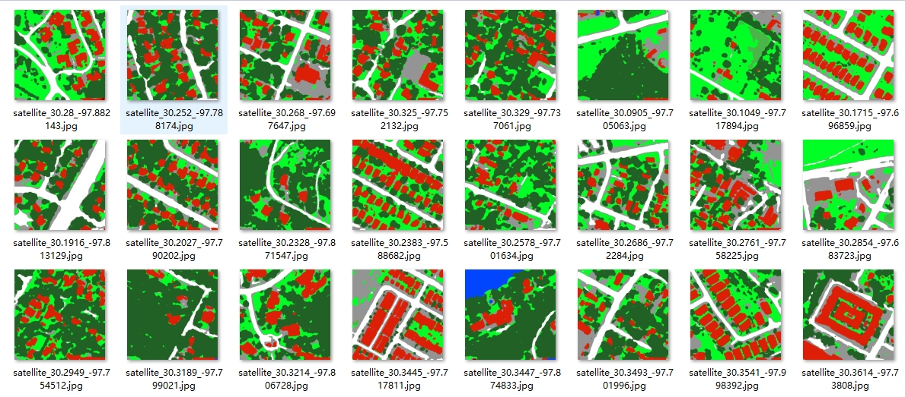
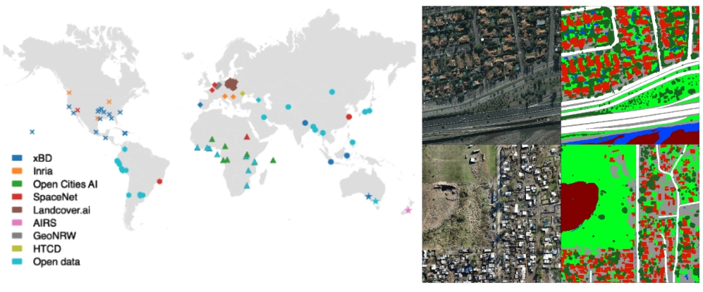

# DeepLabV3Plus for Satellite Image Segmentation - OpenEarthMap

## Synopsis

This repository implements [DeepLabV3+](https://arxiv.org/abs/2210.10732) for high-resolution land cover mapping using the [OpenEarthMap dataset](https://open-earth-map.org/), which consists of 5,000 aerial and satellite images with 8-class annotations across 97 regions from 44 countries. Models trained on OpenEarthMap generalize globally, making them applicable to urban planning, land cover classification, and environmental monitoring.

---

## Dataset Details

1. **OpenEarthMap Dataset**

A comprehensive benchmark dataset featuring 5,000 aerial and satellite images with 8-class manually annotated land cover labels. Covering 97 regions across 44 countries and 6 continents, it offers a global perspective on land cover classification, ensuring robust generalization capabilities for models trained on it.

2. **Custom Datasets**

   - **Scaled Down OpenEarthMap**     A smaller version of the original dataset has been preprocessed, retaining all details but resized and converted into `jpg` and `png` formats for efficient training. The processed dataset is available [HuggingFace](https://huggingface.co/datasets/Zongrong/Small_OpenEarthMap).

   - **City-Specific Dataset**     Over 10,000 remote sensing images annotated across six cities for enhanced segmentation tasks. This dataset can be found [HuggingFace](https://huggingface.co/datasets/Zongrong/House_price).

We utilized the Scaled Down OpenEarthMap dataset for training, which is a smaller, preprocessed version of the original OpenEarthMap dataset, resized and converted into jpg and png formats for efficient training. 

For inference, we applied our trained model to the City-Specific Dataset, which contains over 10,000 remote sensing images annotated across six cities, enhancing segmentation tasks.

---

## About this Python Package

The repository contains two primary modules:

### Training Module  
Implements the DeepLabV3+ training pipeline using the `DeeplabV3Plus_RS_Train.ipynb` notebook with the following features:

   - Pre-trained weights: `deeplabv3_finetuned_RS_openearthmap_v2.pth`,are not included in the GitHub repository due to their large size. You can download the file from the Google Drive: [Download Pre-trained Weights](https://drive.google.com/file/d/1uEt4x-b-U_EFhbVdA-TzpnV-iwbpFDqk/view?usp=sharing)
   - Configuration for semantic segmentation with 8 land cover classes

### Inference Module
The `DeeplabV3Plus_RS_Predict.ipynb` notebook is used for batch processing of satellite images, generating land cover segmentation predictions in .png format with color-coded classes.

---

## Outputs

The model generates segmentation masks with the following classes:

1. **Background**: Black (RGB: 0, 0, 0)
2. **Bareland**: Dark Red (RGB: 128, 0, 0)
3. **Rangeland**: Bright Green (RGB: 0, 255, 36)
4. **Developed Space**: Gray (RGB: 148, 148, 148)
5. **Road**: White (RGB: 255, 255, 255)
6. **Tree**: Dark Green (RGB: 34, 97, 38)
7. **Water**: Blue (RGB: 0, 69, 255)
8. **Agriculture Land**: Light Green (RGB: 75, 181, 73)
9. **Building**: Orange-Red (RGB: 222, 31, 7)

---

## Acknowledgments

- **DeepLabV3+**: [https://arxiv.org/abs/2210.10732](https://arxiv.org/abs/2210.10732)
- **OpenEarthMap**: [https://open-earth-map.org/](https://open-earth-map.org/)
- Hugging Face Datasets:
  - [Small\_OpenEarthMap](https://huggingface.co/datasets/Zongrong/Small_OpenEarthMap)
  - [House\_price](https://huggingface.co/datasets/Zongrong/House_price)

For questions or contributions, feel free to create issues or pull requests.
